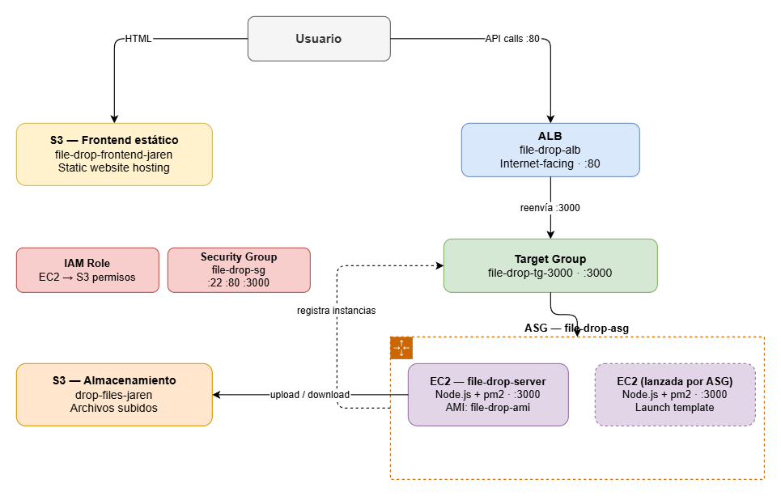

# File-Drop

Minimal file hosting app. Upload files from the browser, store them in S3, and share download links — no login required.

Built with Node.js + Express on the backend and a plain HTML/CSS/JS frontend.

## Stack

- **Backend:** Node.js, Express, Multer
- **Storage:** AWS S3 (`@aws-sdk/client-s3`)
- **Frontend:** Vanilla HTML/CSS/JS (no framework)

## AWS Architecture

The app runs on a production-grade AWS setup with auto scaling and a load balancer:



**Infrastructure components:**

| Resource | Name | Detail |
|---|---|---|
| ALB | `file-drop-alb` | Internet-facing, port 80 |
| Target Group | `file-drop-tg-3000` | Forwards to EC2 :3000 |
| Auto Scaling Group | `file-drop-asg` | Scales EC2 instances automatically |
| EC2 AMI | `file-drop-ami` | Node.js + pm2 pre-installed |
| Security Group | `file-drop-sg` | Ports: 22, 80, 3000 |
| IAM Role | EC2 → S3 | Grants EC2 access to S3 without hardcoded keys |
| S3 (frontend) | `file-drop-frontend-jaren` | Static website hosting |
| S3 (storage) | `drop-files-jaren` | Uploaded files |

## Setup (local)

**1. Clone and install**

```bash
git clone https://github.com/YOUR_USER/file-drop.git
cd file-drop
npm install
```

**2. Configure environment variables**

Create a `.env` file in the root:

```env
PORT=3000
AWS_REGION=us-east-1
AWS_ACCESS_KEY_ID=your_access_key
AWS_SECRET_ACCESS_KEY=your_secret_key
S3_BUCKET_NAME=your_bucket_name
```

**3. Run**

```bash
node src/app.js
```

Open `http://localhost:3000` in your browser.

## Features

- Drag & drop or click to select files
- Upload directly to S3
- List all uploaded files with size and date
- Download any file

## Notes

- EC2 instances use an IAM Role to access S3 — no hardcoded credentials needed in production.
- `.env` is gitignored — never commit credentials.
- The ASG uses the `file-drop-ami` launch template to spin up pre-configured instances automatically.
